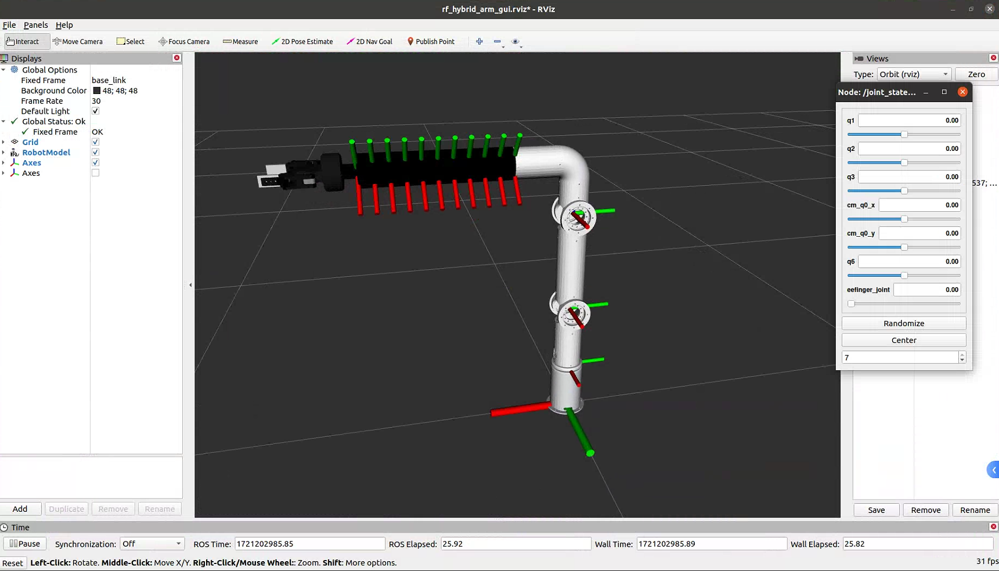

<!--
 * @Author       : ZhangXu tjuzx2016@126.com
 * @Date         : 2024-07-17 15:48:04
 * @LastEditors  : ZhangXu
 * @LastEditTime : 2024-07-17 16:02:14
 * @Description  : 
 * @Refer        : 
 * 
 * Copyright (c) 2024 by 天津大学先进机构学及机器人学中心, All Rights Reserved. 
-->
rf_hybrid_arm
================

The URDF of a rigid-flexible hybrid arm, which contains a continuum module.

## Enviroment

Ubuntu 20.04 + ROS Noetic

## Installation
1. Create a workspace
```
mkdir -p ~/rf_hybrid_arm_ws/src
cd ~/rf_hybrid_arm_ws
```
2. Clone the repository
```
git clone https://github.com/zhx2016/rf_hybrid_arm.git
```
3. Build the package
```
cd rf_hybrid_arm
catkin_make
```
4. Source the workspace
```
source ~/rf_hybrid_arm_ws/devel/setup.bash
```
5. Launch the demo
   
```
roslaunch standard_cr_description rviz_rf_hybrid_arm_gui.launch
```

Then, you can see the rigid-flexible hybrid arm in Rviz:

<div align="center">


Fig1. The demo of the rigid-flexible hybrid arm in Rviz.
</div>

## Reference

[1] xxxxxxx